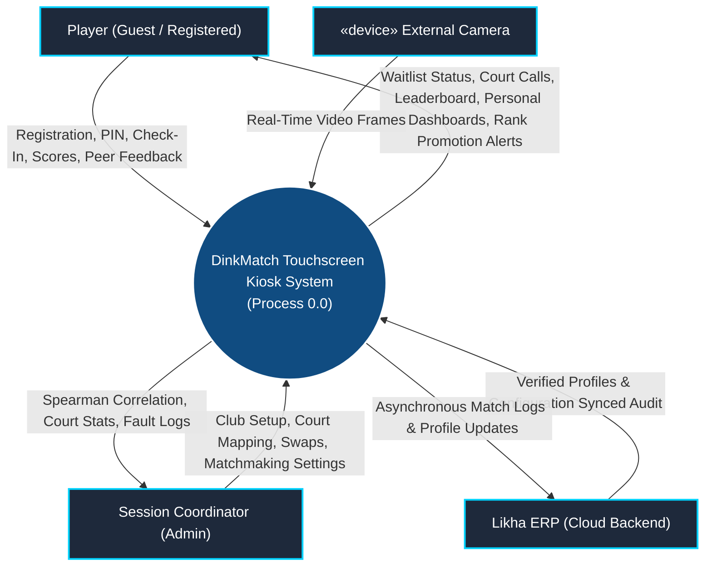
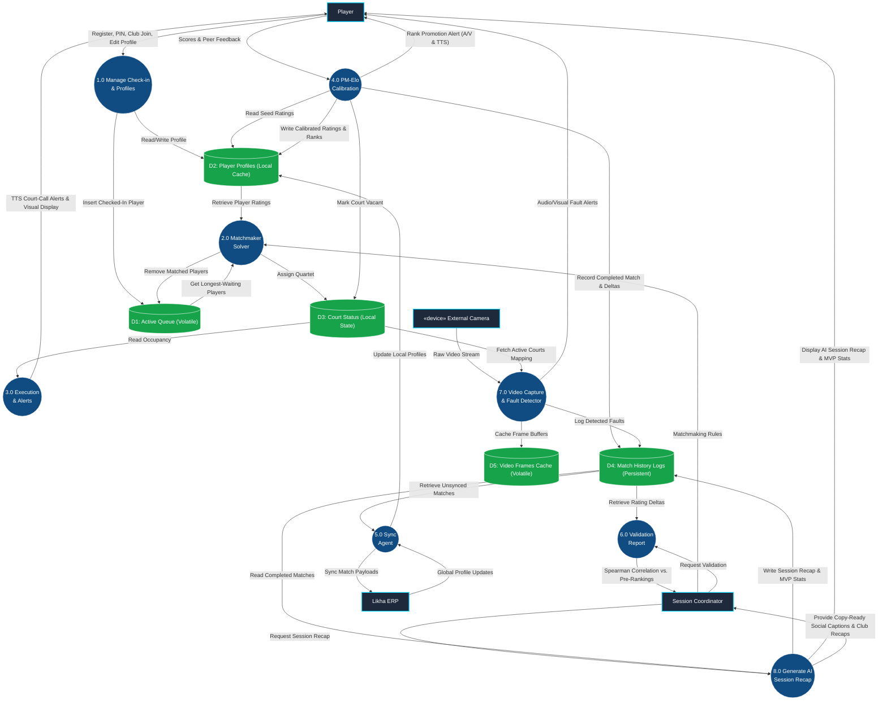
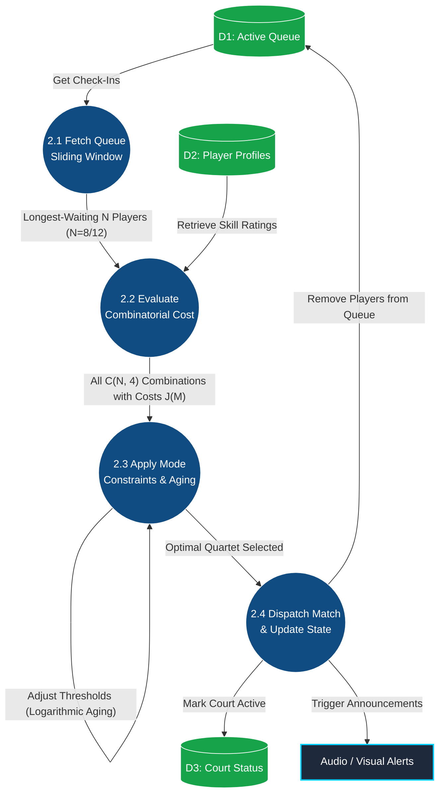
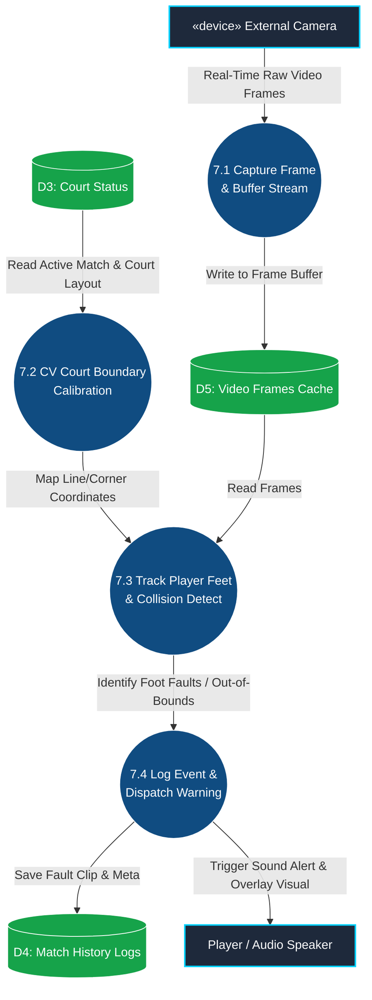

# Data Flow Diagrams (DFD) - DinkMatch

> [!NOTE]
> **Diagram Notation Used:** **Yourdon & Coad Notation**
> - **External Entities:** Rectangles represent users or systems outside the DinkMatch system boundary.
> - **Processes:** Circles/ellipses represent system logic that transforms data inputs.
> - **Data Stores:** Double-parallel horizontal lines indicate persistent or volatile data repositories.
> - **Data Flows:** Directed arrows represent the direction of data elements moving through the system.

This document outlines the Data Flow Diagrams (DFD) for the **DinkMatch** system, including the *Matchmaking Engine* subsystem, *External Camera* device integration, *Line & Foot Fault Detection*, and *Club/Profile management*.

---

## 1. Level 0 Context Diagram
The Level 0 Context Diagram establishes the boundary of the local kiosk application, detailing its interactions with the external entities: the **Player**, the **Session Coordinator**, **Likha ERP** (cloud backend), and the newly integrated **External Camera (Device)**.

---

## 2. Level 1 DFD: Functional Decomposition
The Level 1 DFD decomposes the system boundary into seven core operational processes and five local data stores (Active Queue, Player Profiles, Court Status, Match History, and the new Video Frames Cache).

---

## 3. Level 2 DFD: Process 2.0 (Matchmaking Solver)
This diagram decomposes **Process 2.0 (Matchmaking Solver)** to show how the queue is partitioned, evaluated using a multi-objective cost function, and scheduled.

---

## 4. Level 2 DFD: Process 7.0 (Video Capture & Fault Detection)
This new diagram decomposes **Process 7.0 (Video Capture & Fault Detection)**, showing how frame streams are captured, analyzed for foot and line violations, and dispatched.

