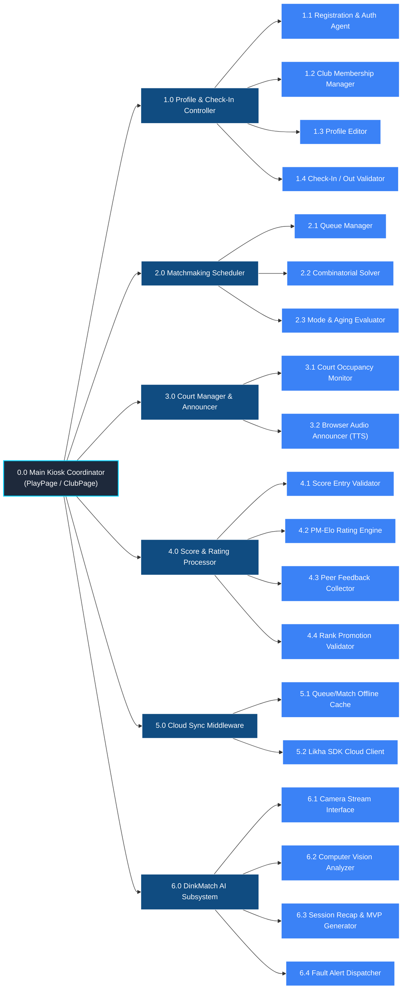

# Structure Chart - DinkMatch

> [!NOTE]
> **Diagram Notation Used:** **Constantine & Yourdon Structure Chart Notation**
> - **Modules:** Rectangular boxes represent software modules (functions/procedures/objects).
> - **Module Call Connection:** Directed lines indicate that a parent module calls or executes a child module.
> - **Data Couple:** Arrows with an empty circle tail represent variables or data structures passed between modules.
> - **Control Flag:** Arrows with a filled circle tail represent control signals or flags (e.g., status flags) passed between modules.

This document presents the **Structure Chart** for the **DinkMatch** system, including the *Matchmaking Engine* subsystem, *External Camera* device integration, *Line & Foot Fault Detection*, and *Club/Profile management*.

---

## 1. Modular Hierarchy Diagram

---

## 2. Module Descriptions & Couples

The table below explains the data couples (D) and control couples (C) flowing between the modules in the hierarchy:

| Parent Module | Child Module | Data Couples (D) / Control Couples (C) | Description |
| :--- | :--- | :--- | :--- |
| **0.0 Main Kiosk** | **1.0 Profile Controller** | **Out (D):** Credentials, Profile Edits, Club Join Request **In (D):** Hydrated Profile, Club Membership data **In (C):** Registration/Login Status Flag (Success/Fail) | Coordinates registrations, logins, profile edits, club joins, and checks-in/out. |
| **1.0 Profile Controller** | **1.1 Registration & Auth** | **Out (D):** Username, Password/PIN, Initial Rating **In (C):** Auth Token, Session Status Flag | Manages player sign-up, sign-in, and sign-out states. |
| **1.0 Profile Controller** | **1.2 Club Membership Manager** | **Out (D):** Club UUID, Player ID **In (C):** Club Join Status (Approved/Pending) | Processes club search and enrollment logic. |
| **1.0 Profile Controller** | **1.3 Profile Editor** | **Out (D):** Avatar edits, display names, DUPR IDs | Commits profile changes to local cache and sync queues. |
| **0.0 Main Kiosk** | **2.0 Matchmaking Scheduler** | **Out (D):** Active Queue List, Court Settings **In (D):** Matched Quartet, Assigned Court ID **In (C):** Match Success Flag (Boolean) | Directs the automated matchmaking search and court assignment loop. |
| **2.0 Matchmaking Scheduler** | **2.1 Queue Manager** | **Out (D):** Player ID, Target Queue **In (D):** Position in Queue | Controls adding, removing, sorting, and positioning players in the waitlist. |
| **0.0 Main Kiosk** | **3.0 Court Manager & Announcer** | **Out (D):** Match Pairings, Court ID **In (C):** Speech Complete Flag | Alerts players of their court assignments via Text-to-Speech audio and visual displays. |
| **0.0 Main Kiosk** | **4.0 Score & Rating Processor** | **Out (D):** Raw Scores, Player Ratings, Teammate IDs **In (D):** Rating Deltas, Updated Profiles **In (C):** Score Saved Flag (Boolean) | Processes score logging, rating calibration, and feedback collection. |
| **4.0 Score Processor** | **4.2 PM-Elo Rating Engine** | **Out (D):** Game Score Margin, Player Ratings **In (D):** Calibrated rating changes | Evaluates win expectancy, point shares, and carry discount rules to update ratings. |
| **4.0 Score Processor** | **4.4 Rank Promotion Validator** | **Out (D):** New Rating, Old Rating **In (D):** Rank promotion alert payload, new tier string | Compares previous rating with updated rating to detect tier transitions and trigger rank-up audio/visual alerts. |
| **0.0 Main Kiosk** | **5.0 Cloud Sync Middleware** | **Out (D):** Unsynced Local Matches, Stats changes **In (D):** Global profiles updates **In (C):** Online Status Flag (Boolean) | Ensures local-first offline continuity with asynchronous background sync. |
| **0.0 Main Kiosk** | **6.0 DinkMatch AI Subsystem** | **Out (D):** Active Court mapping, line coordinates calibration, completed match logs **In (D):** Foot/Line fault event logs, AI session recap markdown, MVP stats **In (C):** Fault alert trigger signal, Recap generation status | Coordinates real-time camera feeds, computer vision analysis, and generative recap updates. |
| **6.0 DinkMatch AI Subsystem** | **6.1 Camera Stream Interface** | **Out (D):** Device ID, Frame Buffer request **In (D):** Raw image frames stream | Interfaces directly with the physical **External Camera** hardware. |
| **6.0 DinkMatch AI Subsystem** | **6.2 Computer Vision Analyzer** | **Out (D):** Raw image frames, mapped line segments **In (C):** Line cross detection event flag (Foot Fault / Out) | Runs edge-detection and object-tracking algorithms to detect foot placement. |
| **6.0 DinkMatch AI Subsystem** | **6.3 Session Recap & MVP Generator** | **Out (D):** Completed Match logs array for the session **In (D):** AI-generated Recap markdown, MVP rankings | Generates natural language summaries of matching sessions, calculates MVPs, and synthesizes copy-ready social media engagement captions / promotional club posts. |
| **6.0 DinkMatch AI Subsystem** | **6.4 Fault Alert Dispatcher** | **Out (D):** Fault details, court number **In (C):** Sound effect trigger, text overlay update | Renders real-time visual warnings on screens and pushes fault signals to speakers. |
