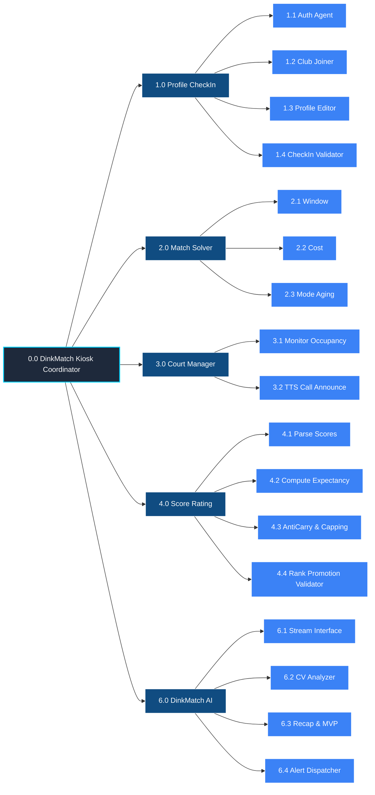

# Hierarchical Input Process Output (HIPO) Diagram - DinkMatch

> [!NOTE]
> **Diagram Notation Used:** **IBM Standard HIPO Visual Table of Contents (VTOC)**
> - **Functional Blocks:** Rectangles represent functional modules or procedures.
> - **Hierarchical Index:** Numeric prefixes (e.g., 0.0, 1.0, 1.1) define the module level and relate directly to their physical Input-Process-Output (IPO) specification sheets.
> - **Structure:** A top-down hierarchical tree structure displaying software logic decomposition.

This document provides the **HIPO (Hierarchical Input Process Output)** specification for the **DinkMatch** system, including the *Matchmaking Engine* subsystem, *External Camera* device integration, *Line & Foot Fault Detection*, and *Club/Profile management*.

---

## 1. Visual Table of Contents (VTOC)

The VTOC shows the hierarchy of the system functions down to the sub-module level. Each module is assigned a reference number matching the IPO sheets.

---

## 2. Input-Process-Output (IPO) Sheets

Below are the IPO sheets for the four most critical processing modules of the DinkMatch system.

### IPO Sheet 1.0: Profile & Check-In Controller
*   **Module Name:** `Profile & Check-In Controller`
*   **Module ID:** `1.0`
*   **Purpose:** Manages registration/auth status, profile alterations, club join forms, and check-in/out logic.

| Inputs | Processes | Outputs |
| :--- | :--- | :--- |
| **From Player (UI Form):** - PIN, password, or login credentials - Profile edit fields (Display name, avatar, DUPR ID) - Club UUID to Join - Check-in/out triggers  **From Database (D2):** - Cached Profile | 1. Capture credentials to authenticate. Run `1.1 Registration & Auth Agent`. If failed, display error. 2. Process profile edits via `1.3 Profile Editor`. Save changes locally and flag for background synchronization. 3. Process club requests via `1.2 Club Membership Manager`. Connect player profile with selected club UUID. 4. Run `1.4 Check-In Validator` to verify active status. If valid, insert player into the active waitlist queue (`D1: Active Queue`). | **To Local Database (D1 / D2):** - Created / edited player profile - Updated club mapping relations - Queue entry added  **To User Interface (UI):** - Login validation state - Profile changes confirmation toast |

---

### IPO Sheet 2.0: Matchmaking Optimization Scheduler
*   **Module Name:** `Matchmaker Solver`
*   **Module ID:** `2.0`
*   **Purpose:** Automatically builds balanced foursomes for doubles matches from waitlisted players.

| Inputs | Processes | Outputs |
| :--- | :--- | :--- |
| **From Queue Store (D1):** - List of checked-in players ordered by arrival time  **From Profiles Cache (D2):** - Individual skill ratings  **From Court Status (D3):** - Count of idle courts  **From Coordinator Settings:** - Operating Mode (Balanced FIFO, Peak Parity, King of the Court) - Weights ($\alpha$, $\beta$) for cost function | 1. Monitor `D3: Court Status` for vacant courts. If none are idle, halt optimization execution. 2. Fetch the top $N$ longest-waiting players from the queue (`2.1 Fetch Queue Sliding Window`). 3. Calculate the rating expansion window ($\delta_i$) for each player using logarithmic wait-time aging: $\delta_i = \delta_{base} + \gamma \ln(1 + W_i)$. 4. Generate all possible four-player combinations $C(N, 4)$ within the sliding window. 5. For each combination, evaluate the joint cost function: $J(M) = \alpha \cdot \sigma^2(R_M) - \beta \cdot \sum W_i$. 6. Filter out quartets that violate the active mode constraints (e.g. Peak Parity rating limits). 7. Pick the quartet that minimizes the joint cost $J(M)$ and assign them to the vacant court. 8. Evict the selected players from `D1: Active Queue`. | **To Local Database (D1):** - Purged Queue Entries (4 players removed)  **To Court Status (D3):** - Updated Court State (occupancy status set to active, occupant names mapped)  **To Announcer (3.2):** - Audio TTS announcement trigger payload |

---

### IPO Sheet 4.0: Score & Rating Processor
*   **Module Name:** `Score & Rating Processor`
*   **Module ID:** `4.0`
*   **Purpose:** Calibrates player skill ratings statelessly based on score margins and team dynamics immediately after a match finishes.

| Inputs | Processes | Outputs |
| :--- | :--- | :--- |
| **From Scoreboard UI:** - Match ID - Team 1 Score ($S_1$) - Team 2 Score ($S_2$)  **From Profiles Cache (D2):** - Teammate and opponent ratings  **From Peer Feedback UI:** - Sportsmanship badges / Conduct tags | 1. Capture the final scores $S_1$ and $S_2$. 2. Calculate point shares: $S'_{T1} = S_1/(S_1 + S_2)$ and $S'_{T2} = S_2/(S_1 + S_2)$. 3. Calculate average ratings for Team 1 ($R_{T1}$) and Team 2 ($R_{T2}$). 4. Compute logistic win expectancies: $E_{T1} = 1/(1 + 10^{(R_{T2}-R_{T1})/400})$ and $E_{T2} = 1 - E_{T1}$. 5. Compute the raw Elo change: $\Delta = K \cdot (S'_T - E_T)$. 6. Apply the teammate anti-carry discount: if rating gap exists, scale down the rating gain of the higher-skilled player carrying the match. 7. Apply partner adjustment capping to ensure that teammate rating adjustments do not exceed a maximum variance ratio (e.g., 70/30 distribution). 8. Apply high K-value calibration factor if a player has "No Rating" status. 9. Run `4.4 Rank Promotion Validator` to evaluate whether the new rating crosses any skill category boundaries (1400, 1700, 1900, 2100). If so, update player's `currentRank`, `rankUpdatedAt`, and trigger a promotion/tier-change alert. 10. Commit updated skill ratings and ranks to `D2: Player Profiles` and write match logs to `D4: Match History Logs`. 11. Vacate the court in `D3: Court Status` and return players to queue. | **To Local Database (D2):** - Updated calibrated ratings and ranks  **To Match Logs (D4):** - Written Match Record (scores, rating deltas, peer badges, sync flag = false)  **To Court Status (D3):** - Vacated Court State (occupancy set to idle)  **To User Interface (UI) / Audio Speakers:** - Live dashboard updates (Leaderboard standings) - Rank Promotion Alert (visual popup card & TTS announcement) |

---

### IPO Sheet 6.0: DinkMatch AI Subsystem Controller
*   **Module Name:** `DinkMatch AI Controller`
*   **Module ID:** `6.0`
*   **Purpose:** Captures video stream frames to identify foot/line violations, and generates session summaries, social media promotional captions, and MVP rankings from session match logs.

| Inputs | Processes | Outputs |
| :--- | :--- | :--- |
| **From External Camera:** - Real-time raw video frames stream  **From Court Status (D3):** - Active court boundary mapping metrics (kitchen line / baseline coordinates)  **From Match History Logs (D4):** - Completed match logs array for the active session | 1. Capture stream using `6.1 Camera Stream Interface`. Write raw frame images to cache `D5`. 2. Run edge-detection algorithms via `6.2 Computer Vision Analyzer` to identify court lines. 3. Track player foot coordinates relative to active court lines. If violation occurs, trigger `6.4 Fault Alert Dispatcher` to flash overlay and play sound alert. 4. Trigger `6.3 Session Recap & MVP Generator` at the end of the session to read matches from `D4`. Calculate MVP standings and generate copy-ready social media captions. | **To Local Database (D4):** - Saved Fault Log (Timestamp, Match ID, Fault Type) - Saved AI Session Recap markdown text and MVP stats table  **To User Interface (UI) / Audio Speakers:** - Audio warning ("Foot fault!") - Red visual warning flash overlay - Copy-ready social media caption and newsletter post panel on Coordinator dashboard |
