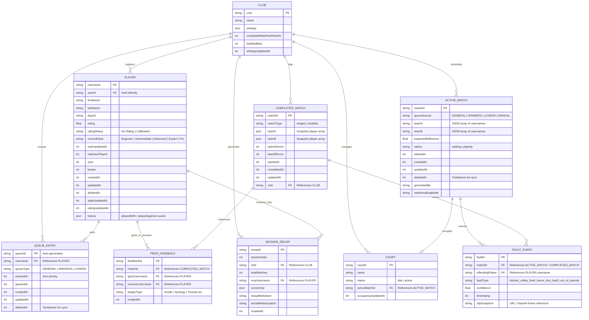

# Entity Relationship Diagram (ERD) - DinkMatch

> [!NOTE]
> **Diagram Notation Used:** **IE (Information Engineering) Crow's Foot Notation**
> - **Entities:** Rectangles represent database tables. Primary Keys (PK) and Foreign Keys (FK) are designated alongside field attributes.
> - **Cardinality Relationships:** Connecting lines specify database mapping dependencies:
>   - `||--|{` One-to-Many relationship.
>   - `||--o{` Zero-to-Many relationship.
>   - `||--o|` Zero-to-One relationship.

This document outlines the **Entity Relationship Diagram (ERD)** for the **DinkMatch** system, including the *Matchmaking Engine* subsystem, *External Camera* device integration, *Line & Foot Fault Detection*, and *Club/Profile management*.

---

## 1. Mermaid Entity Relationship Diagram

---

## 2. Cardinality & Relationships Description

1.  **CLUB to PLAYER (1:N)**: A club manages registrations for multiple players. A player belongs to one club session at a time in the kiosk context.
2.  **CLUB to COURT (1:N)**: A club facility manages $C$ physical courts. Each court belongs to one club.
3.  **CLUB to QUEUE_ENTRY (1:N)**: A club hosts multiple player queue entries in its open-play session.
4.  **PLAYER to QUEUE_ENTRY (1:1/1:N)**: A player can only have one active (non-deleted) queue entry at any time. History is stored via soft deletion (deletedAt timestamps).
5.  **ACTIVE_MATCH to COURT (1:1)**: An active match occupies exactly one court, and an active court runs exactly one active match.
6.  **ACTIVE_MATCH/COMPLETED_MATCH to FAULT_EVENT (1:N)**: An active match detects and logs multiple foot/line faults, which persist into the completed match record history.
7.  **COMPLETED_MATCH to PEER_FEEDBACK (1:N)**: A completed match can generate multiple peer feedback badge reviews (e.g. commendations for teammates/opponents).
8.  **PLAYER to PEER_FEEDBACK (1:N)**: A player can submit feedback (as a giver) and receive badges (as a receiver) from other players.
9.  **CLUB to SESSION_RECAP (1:N)**: A club generates multiple session recaps over time (one per open play night/session).
10. **PLAYER to SESSION_RECAP (1:N)**: A player can be selected as the session MVP across multiple session recaps.
